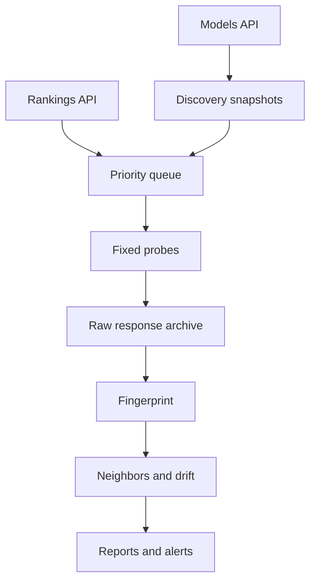

# Model Radar

Discover, fingerprint, and monitor emerging black-box LLMs.

Model Radar watches the OpenRouter catalog for new, stealth, alpha, preview, and rapidly growing models. It can automatically capture a fixed behavioral probe set, compute a comparable fingerprint, find behavioral neighbors, and alert when a model slug appears to change.

It is an observability tool, not an identity oracle. Behavioral proximity does not prove shared weights, provenance, distillation, or ownership.

## What works in v0.1

- OpenRouter Models API discovery with immutable metadata snapshots and locally recorded `first_seen` timestamps.
- Exact daily top-50 ranking ingestion, with category/language slices marked as estimated.
- Transparent additive radar score for novelty, trend, stealth status, free preview status, and capability interest.
- Synchronous and OpenRouter Batch API text probing.
- Full raw response retention per run, including generation ID, returned model, provider, finish reason, usage, and response envelope when available.
- Two fingerprint backends:
  - `hash`: fast, dependency-light behavioral feature hashing for monitoring and CI.
  - `reptrace`: ordered response embeddings followed by one shared seeded Gaussian projection, compatible with the core LLM-DNA/RepTrace construction.
- Repeated probes, within-run noise estimation, drift thresholds, and nearest-neighbor lookup.
- SQLite storage, Markdown model cards, generic/Discord/Slack webhooks, and a local read-only dashboard.
- Offline fixtures and tests; no API key is needed to evaluate the project.

## Architecture



Discovery and popularity decide what to measure. They are not treated as evidence of model quality or identity.

## Install

```bash
git clone <your-fork-url> model-radar
cd model-radar
python -m venv .venv
source .venv/bin/activate
pip install -e .
model-radar init
```

For the RepTrace fingerprint backend:

```bash
pip install -e '.[reptrace]'
```

Set credentials in your environment, not in YAML:

```bash
export OPENROUTER_API_KEY='...'
```

On Windows PowerShell:

```powershell
$env:OPENROUTER_API_KEY='...'
```

## Try the complete pipeline offline

From a source checkout:

```bash
cp model-radar.example.yaml model-radar.yaml
model-radar discover --fixture tests/fixtures/models.json
model-radar trends --fixture tests/fixtures/rankings.json
model-radar queue
model-radar probe stealth/ox-alpha \
  --fixture-responses tests/fixtures/responses.json \
  --repetitions 3
model-radar probe deepseek/deepseek-v4-flash-0731 \
  --fixture-responses tests/fixtures/responses.json \
  --repetitions 3
model-radar report
model-radar serve
```

Open <http://127.0.0.1:8765>.

## Live usage

Discover models and ingest the latest exact daily rankings:

```bash
model-radar discover
model-radar trends
model-radar queue --min-score 45
```

Probe an explicit model synchronously:

```bash
model-radar probe stealth/ox-alpha \
  --transport sync \
  --repetitions 3 \
  --backend hash
```

Use OpenRouter's asynchronous text Batch API:

```bash
model-radar probe stealth/ox-alpha \
  --transport batch \
  --repetitions 3 \
  --backend reptrace
```

For a public model with multiple provider endpoints, pin one provider and disable fallback so routing changes do not masquerade as model drift:

```bash
model-radar probe meta-llama/llama-3.3-70b-instruct \
  --provider-only together \
  --no-allow-fallbacks
```

The config defaults to `allow_fallbacks: false`. If no provider is specified, Model Radar still stores the routing metadata returned by OpenRouter.

Scan an explicit list:

```bash
model-radar scan \
  --models stealth/ox-alpha,deepseek/deepseek-v4-flash-0731 \
  --transport batch \
  --limit 2 \
  --yes-spend
```

`scan` requires `--yes-spend` because it can automatically issue many paid API calls. A single explicit `probe` does not require this extra flag.

## CLI

| Command | Purpose |
| --- | --- |
| `init` | Create starter YAML, probes, and SQLite schema |
| `discover` | Snapshot the current OpenRouter model catalog |
| `trends` | Ingest ranking observations and recompute scores |
| `queue` | Show the highest-priority active models |
| `probe MODEL` | Acquire fresh responses and fingerprint one model |
| `scan` | Probe an explicit list or high-priority queue |
| `report [MODEL]` | Write Markdown model cards |
| `serve` | Start the local read-only dashboard |

Run `model-radar COMMAND --help` for all options.

## Storage and cache behavior

Every probe execution gets a unique `run_id`. Responses are never reused across runs. This is deliberate: an ordinary response cache can make a swapped backend appear perfectly stable.

SQLite contains:

- current model records plus deduplicated metadata snapshots;
- ranking observations and whether they are exact or estimated;
- probe protocols, raw responses, operational metadata, and failures;
- fingerprints, within-run variability, and detected drift events.

Generated databases, reports, credentials, and local data are ignored by Git.

## Fingerprint semantics

The default `hash` backend is intentionally lightweight. It is useful for running the monitor, smoke-testing a deployment, and detecting large behavioral changes. It is not the published LLM-DNA representation.

The optional `reptrace` backend:

1. embeds every response with one fixed sentence encoder;
2. concatenates embeddings in stable probe order;
3. applies the same seeded Gaussian projection for every model and run;
4. normalizes the resulting vector.

Fingerprint comparisons are only made when backend, dimension, seed, encoder, and probe-set hash match. This prevents accidental comparison across incompatible coordinate systems.

For repeated runs, Model Radar computes one fingerprint per repetition, averages the normalized fingerprints, and records mean pairwise within-run distance. The alert threshold is:

```text
max(configured_distance_threshold,
    noise_multiplier × max(previous_within_run_noise, current_within_run_noise))
```

This is a practical false-alert guard, not a formal proof that the backend changed.

## Ranking caveats

- OpenRouter's exact daily dataset contains only the top 50 public models plus an aggregate `other` row.
- A missing model is treated as censored, never as zero usage.
- Category and language-type slices are sampled weekly estimates and are marked as estimated in storage.
- Token counts come from provider-native tokenizers, so cross-provider volume comparisons are approximate.
- Popularity determines monitoring priority; it is not a capability score.

## Automation

The included workflows run tests, restore/save the SQLite state through GitHub Actions cache, perform hourly discovery, and optionally run daily probes. Configure:

- repository secret `OPENROUTER_API_KEY`;
- optional repository secret `RADAR_WEBHOOK_URL`;
- repository variable `RADAR_MODELS` containing comma-separated model IDs for the daily scan.

Scheduled scans use Batch API and require an explicit model list; the project never probes every discovered model by default.

## Test

The suite uses only local fixtures:

```bash
python -m unittest discover -s tests -v
```

## Project status

This is an alpha MVP. Useful next additions are provider-endpoint history, a public static dashboard export, richer probe packs, a pluggable external LLM-DNA command adapter, and persistence backends beyond SQLite.

## License

Apache-2.0. This project is independent of OpenRouter and is not endorsed by OpenRouter.

